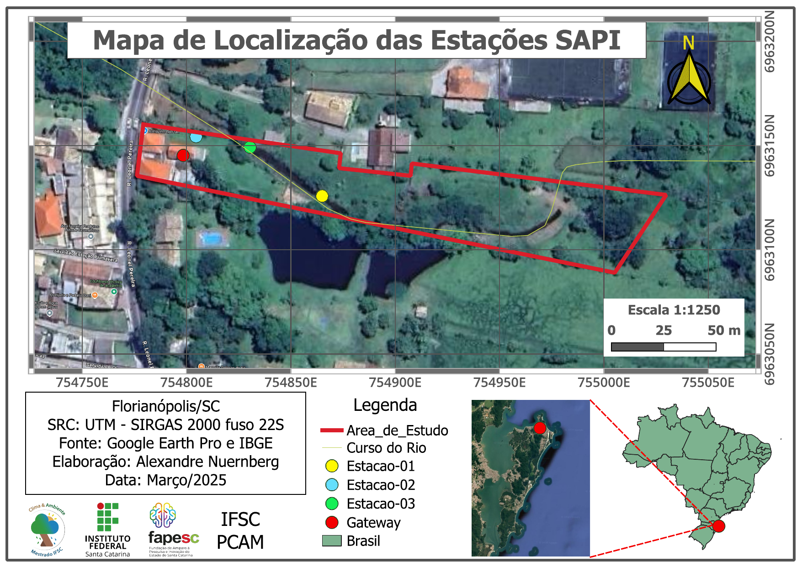
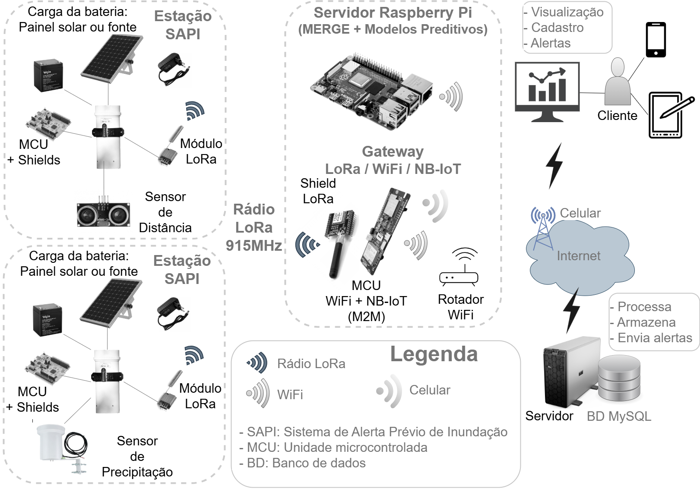

# SAPI — System overview

Technical specification of the SAPI flood early-warning system: stations, gateway,
communication, requirements and software stack. The dissertation is the authoritative
source; this document summarises it for people working with the code.

## Project

| | |
|---|---|
| Institution | Federal Institute of Santa Catarina (IFSC) — Florianópolis Campus |
| Program | Master's Program in Climate and Environment (*Stricto Sensu*) |
| Research line | Instrumentation and Technological Development |
| Author | Alexandre Nuernberg |
| Qualification | 2025-05-19 |

**General objective:** develop and validate a flood monitoring and early-warning system.

**Specific objectives:** (1) implement real-time monitoring of water level and
precipitation; (2) apply a machine-learning model to predict the flood water level;
(3) validate the system's prediction and alert performance in a real environment.

## Functional requirements

- Easy installation and operation
- Ultra-low-power components
- Grid-independent operation
- Water level **and** precipitation measurement (non-contact ultrasonic sensing and a
  tipping-bucket rain gauge)
- Multi-level alerts (Atenção / Alerta / Inundação) automatically sent to registered
  contacts — see [`webserver/alert-systems-overview.md`](webserver/alert-systems-overview.md)
- Long-range communication: the target is 5–10 km, enough to cover a stream's course or
  several points of a neighbourhood (LoRa reaches 1–15 km depending on terrain)
- Web interface for management, data visualisation and alert registration
- Low-cost components (the most expensive single item is the R$ 956 tipping-bucket rain
  gauge — see [`hardware/BOM_custos.md`](hardware/BOM_custos.md))

## Field deployment

All stations are in the Cachoeira do Bom Jesus neighbourhood, Florianópolis (north of the
island), on one urban stream. Two water-level stations are mounted on bridges; the rain
gauge stands on the lawn in front of the residence that also houses the gateway.

### Station-01 — water level

| | |
|---|---|
| In operation since | 2024-12-30 |
| MCU | STM32F103C8T6 (BluePill, 64 KB flash) |
| Sensor | HC-SR04 ultrasonic (max. range 4.5 m), 11-reading median filter |
| Radio | LoRa RFM95W (SX1276), 915 MHz |
| Power | Grid, with a 4,200 mAh battery backup |
| Sampling | ~1 min |
| Installation | Bridge, ~70 m from the gateway |
| Position | 27°25'53.13"S, 48°25'18.83"W |
| Calibration | `levelZero` = 291.0 cm |
| Source / release | [`firmware/station-01/`](../firmware/station-01/) · `station-01-v1.0.0` |

### Station-02 — precipitation

| | |
|---|---|
| In operation since | 2026-01-02 |
| MCU | STM32 Nucleo F103RB |
| Shields | SAPI Shield Morpho V1.2 (power control, rain-gauge pulse storage) and SAPI LoRa Arduino Shield V1.0 |
| Sensors | Tipping-bucket rain gauge PB10 (0.25 mm/pulse), BMP280 (temperature, pressure), ADC for Vpanel and Vbat |
| Radio | LilyGo LoRa32 |
| Power | Solar, 12 V / 2.3 Ah sealed lead-acid battery, deep sleep |
| Sampling | ~15 min |
| Installation | Lawn in front of the residence (not on a bridge) |
| Source / release | [`firmware/station-02/`](../firmware/station-02/) · `station-02-v1.0.0` |

### Station-03 — water level

| | |
|---|---|
| In operation since | 2026-03-01 |
| MCU | STM32 Nucleo L476RG (ultra-low-power L4 series) |
| Sensors | US-100 ultrasonic in **serial mode** (its firmware compensates the speed of sound for temperature internally), SHT20 (ambient temperature and humidity, reported as telemetry only), ADC for Vpanel and Vbat |
| Radio | LilyGo LoRa32 |
| Power | Solar, 12 V / 4.3 Ah Li-ion battery, EPEVER Tracer2606BP charger |
| Sampling | ~5 min |
| Installation | Second bridge, ~30 m from the gateway (41 m from Station-01) |
| Calibration | `levelZero` = 236 cm (reads 199 cm at a river level of 37 cm, 2026-03-01) |
| Note | The ST-Link was removed from the Nucleo board to save power; flashing needs external SWD wiring |
| Source / release | [`firmware/station-03/`](../firmware/station-03/) · `station-03-v1.0.0` |

A power/connector fault in August 2026 produced spurious ~335 cm readings and a burst of
false alerts; it was diagnosed and repaired, and the affected data flagged invalid — see
[`hardware/station-03-power-instability-2026-08/`](hardware/station-03-power-instability-2026-08/README.md).

### Gateway-01

| | |
|---|---|
| Hardware | LilyGO T-SIM7000G (ESP32 + SIM7000G modem) with a LoRa32 radio |
| Location | Indoors, next to the Wi-Fi router |
| Function | Receives the LoRa packets, validates them and forwards them to the web server over HTTPS |
| Links | Wi-Fi (primary) and NB-IoT cellular failover |
| Source / release | [`firmware/gateway-01/`](../firmware/gateway-01/) · `gateway-01-v2.0.0` |

The NB-IoT failover (SSLClient/BearSSL, TLS 1.2 on both links) was validated in production
on 2026-03-08: 260 transmissions, 247 over Wi-Fi and 13 over NB-IoT, 100 % delivered. It is
inactive today because the M2M SIM used in the test was on loan and has been returned; the
gateway runs on Wi-Fi only until a permanent SIM is installed. LTE-M-only SIMs do not work
with this firmware. Test report: [`tests/m2m/`](tests/m2m/M2M_Test_Report.md).

## Communication

| | |
|---|---|
| Frequency | 915 MHz (Brazilian ISM band, ANATEL) |
| Serialisation | MessagePack (40–60 % smaller than JSON) |
| Authentication | HMAC-SHA256 with a pre-shared key |
| Payload | Binary sensor readings + timestamp + station id |
| Sampling interval | Configurable per station, 1–15 min |

## Sensors

- **HC-SR04** (Station-01): low cost, 4.5 m range.
- **US-100** (Station-03): in serial mode it read reliably to 350–420 cm in the bench
  tests; in trigger/echo mode only to ~165 cm, too short for a bridge. See
  [`tests/us-100/`](tests/us-100/).
- **AJ-SR04M**: supported by the Morpho shield's interface, not yet tested.
- Ultrasonic sensors are prone to spurious readings from reflections and need in-situ
  calibration against a staff gauge.

## Microcontroller selection

Evaluated for the stations: deep-sleep consumption, processing capacity, ecosystem
support and physical volume — the 100 mm PVC housing limits the battery to ≤ 6.0 Ah, far
below the ≤ 22 Ah of larger professional stations, so active-mode consumption matters.

- **Rejected:** generic Arduino boards (auxiliary components keep sleep current in the mA
  range); Nordic nRF52/nRF53 (lowest active consumption, but a separate SDK ecosystem);
  ESP32 for the stations (higher active consumption in that energy budget — it is used for
  the grid-powered gateway).
- **Chosen:** STM32L476RG (Station-03, ultra-low-power L4 series); STM32F103C8T6 BluePill
  (Station-01, ~4 mA average in its operating cycle); STM32F103RB Nucleo (Station-02).

## Software stack

**Station firmware:** PlatformIO (Arduino framework for STM32), ARM GCC; libraries
`sandeepmistry/LoRa`, `hideakitai/MsgPack`, ArduinoJson; STOP2 low-power mode with RTC
alarm wake-up, unused pins set to analog, peripheral clock gating.

**Gateway firmware:** Arduino/ESP-IDF on the ESP32; continuous LoRa RX with
interrupt-driven packet handling, Wi-Fi auto-reconnect, NB-IoT failover.

**Gateway flow:** receive the LoRa packet → validate the HMAC → decode MessagePack →
forward to the server over Wi-Fi (or NB-IoT) → log the result.

**Server side:** PHP/MariaDB web interface and alert cron jobs on shared hosting
([`../webserver/`](../webserver/)); MERGE/CPTEC precipitation ingestion
([`../pipelines/merge2mysql/`](../pipelines/merge2mysql/)); M4 (LightGBM) and M6 (MLR)
forecasts on a Raspberry Pi ([`../predictive-models/`](../predictive-models/)).

## Known limitations and roadmap

- Firmware: no watchdog in every station yet; no persistent error log; the 48 h offline
  buffer in flash is specified but not implemented; LoRa retries without exponential
  backoff; firmware not yet unified across station types.
- Gateway: no packet acknowledgement; no local offline queue; no OTA updates; a permanent
  M2M SIM is still needed to use the NB-IoT failover.
- Web interface: mobile layout, data export formats and a station-health dashboard are
  pending.
- Hardware: AJ-SR04M sensor still to be tested; EPEVER charger still to be configured for
  lithium batteries.
