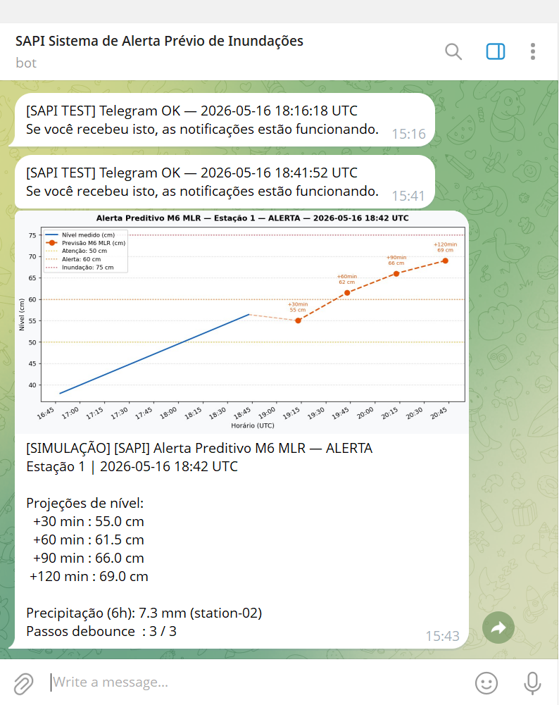
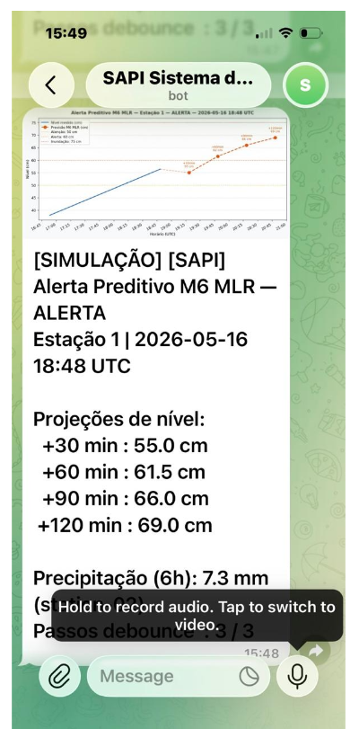
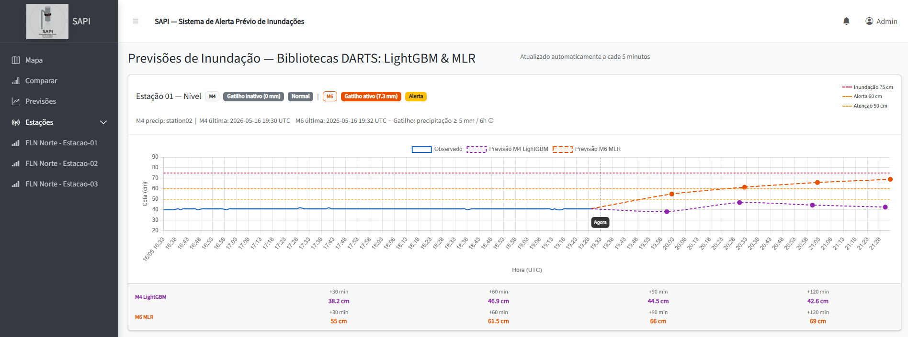
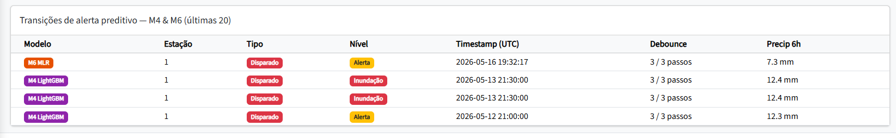
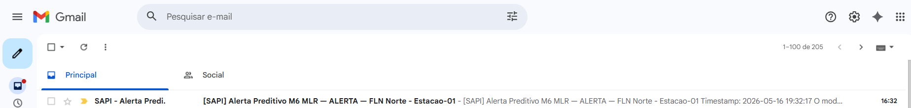
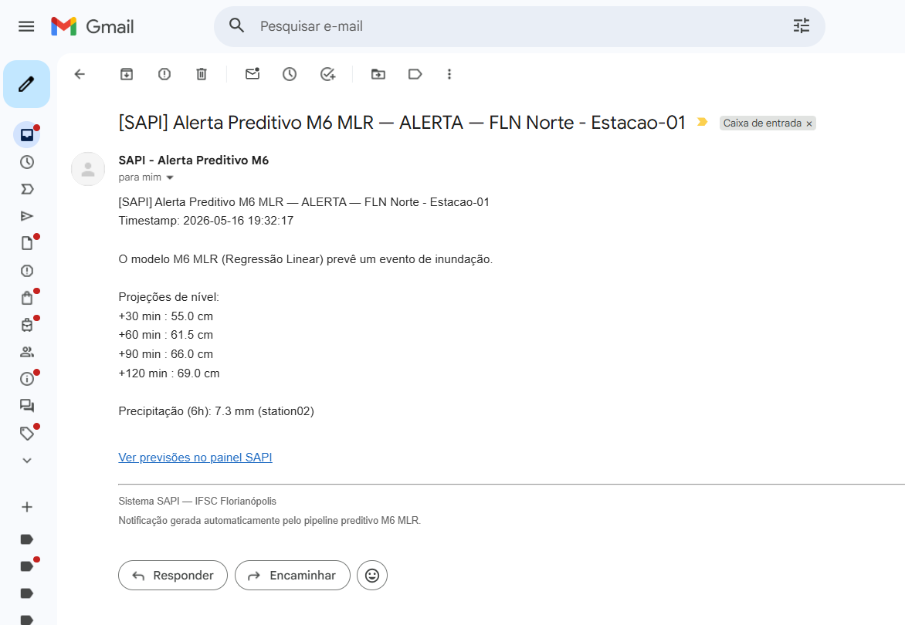
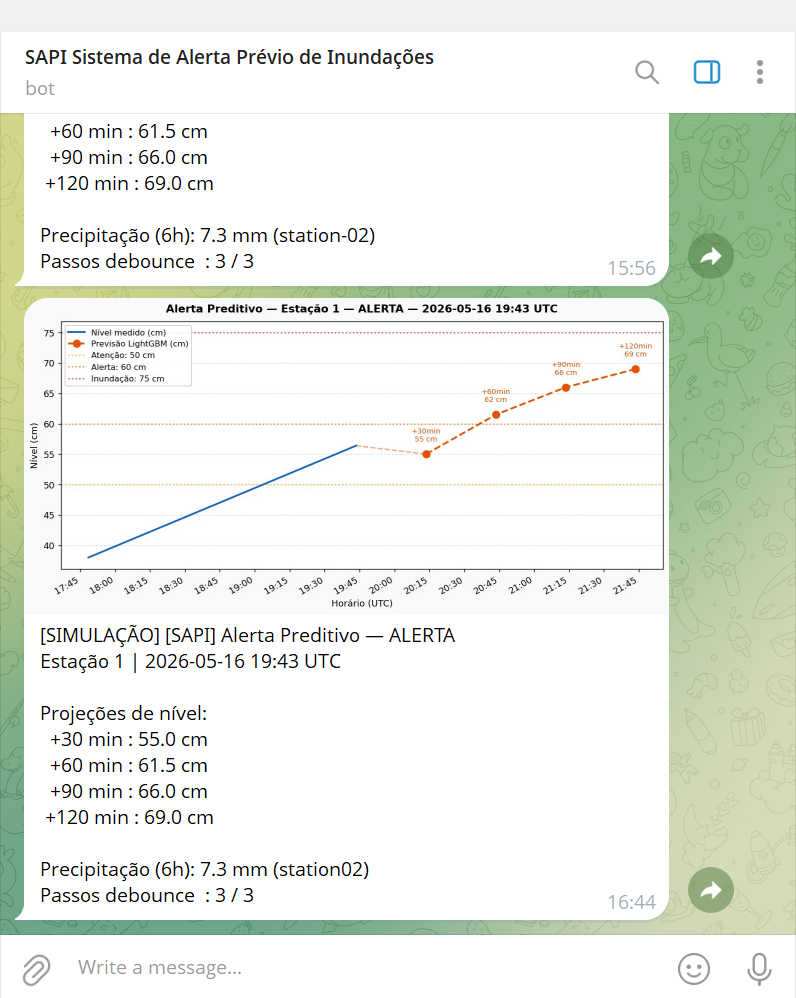
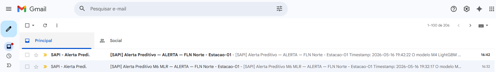
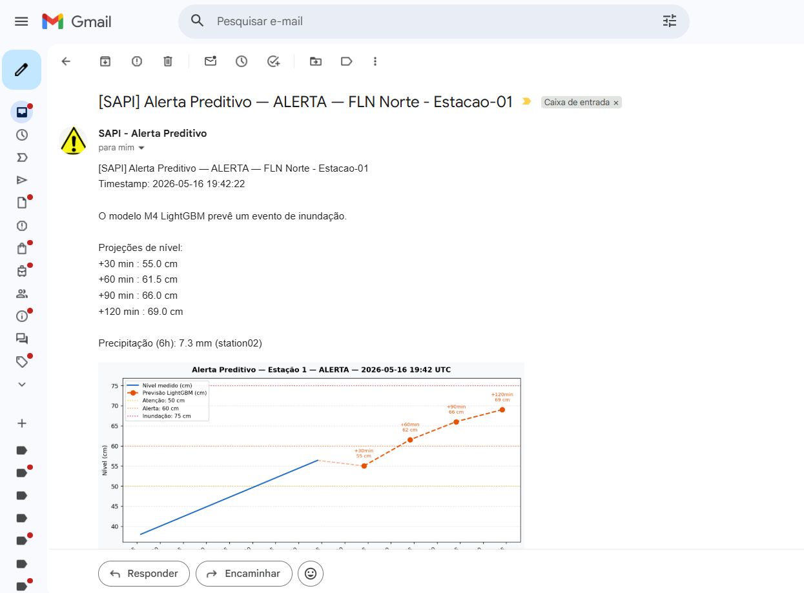
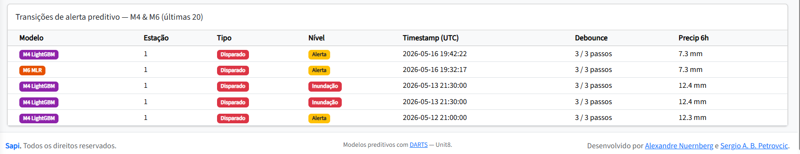

# SAPI — End-to-End Notification Test: M4 LightGBM & M6 MLR

**Issue:** #122  
**Date:** 2026-05-16  
**Tester:** Alexandre Nuernberg  
**Result:** PASS ✅

---

## Objective

Validate the complete notification pipeline for both predictive models after Issue #110 (notifications) and Issue #120 (M6 production deployment):

- **Telegram** — `sendPhoto` with prediction chart (Python / RPi side)
- **Email** — PHPMailer + Gmail SMTP with embedded chart (PHP / Hostinger side)
- **Database** — `prediction_alerts` and `prediction_alerts_m6` tables updated
- **Web interface** — alert badge and transition table on `predictions.php`

Tests were performed in this order: **M6 first, then M4**, so failures could be isolated by model.

---

## Notification Architecture

```
RPi (Python)
  sapi_predict_m6.py  OR  sapi_predict.py
    │
    ├── 1. telegram_notifier_m6.notify_alert()  ──► Telegram sendPhoto  (fired)
    │         └── returns img_bytes (PNG)             sendMessage        (cleared)
    │
    └── 2. POST JSON + chart_b64 ──► Hostinger PHP endpoint
              predictions_m6.php  OR  predictions.php
                │
                ├── INSERT into predictions_m6 / predictions
                ├── INSERT into prediction_alerts_m6 / prediction_alerts
                └── sendEmailViaSMTP() via PHPMailer + Gmail SMTP
```

> **Important:** Telegram is sent exclusively from the RPi Python side. A direct `curl` POST to the PHP endpoint triggers **email + DB only** — not Telegram. In a real flood event both steps fire automatically in sequence.

---

## Pre-requisites

- RPi running with cron active for both models
- Contacts registered at `https://ilha3d.com/sapi/admin/contacts.php`
- API key available at `/home/ilha3d/SAPI/MLR_Production/config/api_key.txt` (same key for M4 and M6)
- Python venv: `/home/ilha3d/SAPI/LightGBM_Production/.venv`

---

## Step 1 — Telegram Connectivity (text message)

Quick test to confirm bot token and chat IDs are valid before sending photos.

```bash
/home/ilha3d/SAPI/LightGBM_Production/.venv/bin/python3 \
    /home/ilha3d/SAPI/LightGBM_Production/test_telegram.py
```

Expected output:
```
chat_id=<CHAT_ID> → OK
Result: 1/1 sent.
```

---

## Step 2 — M6 MLR: Telegram Photo (direct Python test)

Sends a simulated `fired` alert photo using M6's chart builder directly — no DB, no email.
Useful to test Telegram photo delivery in isolation.

```bash
/home/ilha3d/SAPI/LightGBM_Production/.venv/bin/python3 /tmp/test_m6_alert_photo.py
```

`/tmp/test_m6_alert_photo.py` content:

```python
import sys, os
from datetime import datetime, timedelta, timezone

sys.path.insert(0, "/home/ilha3d/SAPI/MLR_Production")
os.chdir("/home/ilha3d/SAPI/MLR_Production")

import telegram_notifier_m6 as tg_mod

ts_now = datetime.now(timezone.utc)
level_rows = []
base = 38.0
for i in range(24):
    t = ts_now - timedelta(minutes=(23 - i) * 5)
    level_rows.append({"timestamp": t.isoformat(), "value": base + i * 0.8})

result = {
    "h_pred_30": 55.0, "h_pred_60": 61.5,
    "h_pred_90": 66.0, "h_pred_120": 69.0,
    "alert_level": "alerta",
    "precip_rolling": 7.3, "precip_source": "station02",
    "consecutive_steps": 3,
}

tg_cfg = tg_mod._load_config()
bot_token = tg_cfg["bot_token"]
chat_ids  = tg_cfg["chat_ids"]

img_bytes = tg_mod.build_alert_chart(result, level_rows, 1)
caption   = "[SIMULAÇÃO] " + tg_mod._build_fired_caption(result, 1)

for chat_id in chat_ids:
    ok = tg_mod.send_telegram_photo(bot_token, chat_id, caption, img_bytes)
    print(f"  chat_id={chat_id} → {'OK' if ok else 'FAILED'}")
```

**Result:** Photo received on Telegram desktop (Windows 11) and iPhone. ✅





---

## Step 3 — M6 MLR: Full Pipeline (DB + Email) via curl

Generate the payload with the prediction chart in base64, then POST to the M6 PHP endpoint.

### 3a. Generate payload

```bash
cd /home/ilha3d/SAPI/MLR_Production && \
/home/ilha3d/SAPI/LightGBM_Production/.venv/bin/python3 - <<'EOF'
import sys, os, base64, json
from datetime import datetime, timedelta, timezone

sys.path.insert(0, "/home/ilha3d/SAPI/MLR_Production")
os.chdir("/home/ilha3d/SAPI/MLR_Production")

import telegram_notifier_m6 as tg_mod

ts_now = datetime.now(timezone.utc)
level_rows = [{"timestamp": (ts_now - timedelta(minutes=(23-i)*5)).isoformat(),
               "value": 38.0 + i * 0.8} for i in range(24)]

result = {
    "h_pred_30": 55.0, "h_pred_60": 61.5,
    "h_pred_90": 66.0, "h_pred_120": 69.0,
    "alert_level": "alerta",
    "precip_rolling": 7.3, "precip_source": "station02",
    "consecutive_steps": 3,
}

img_bytes = tg_mod.build_alert_chart(result, level_rows, 1)
chart_b64 = base64.b64encode(img_bytes).decode()

payload = {
    "station_id": 1,
    "timestamp": ts_now.strftime("%Y-%m-%dT%H:%M:%SZ"),
    "h_pred_30": 55.0, "h_pred_60": 61.5, "h_pred_90": 66.0, "h_pred_120": 69.0,
    "precip_rolling": 7.3, "precip_source": "station02",
    "gate_active": True,
    "raw_alert_level": "alerta", "alert_level": "alerta",
    "consecutive_steps": 3,
    "alert_transition": "fired",
    "chart_b64": chart_b64,
}

with open("/tmp/m6_test_payload.json", "w") as f:
    json.dump(payload, f)
print(f"Payload: {len(json.dumps(payload))} bytes")
EOF
```

### 3b. POST to predictions_m6.php

```bash
API_KEY=$(cat /home/ilha3d/SAPI/MLR_Production/config/api_key.txt)

curl -s -X POST https://ilha3d.com/sapi/api/predictions_m6.php \
  -H "Content-Type: application/json" \
  -H "X-API-Key: $API_KEY" \
  -d @/tmp/m6_test_payload.json
```

Expected response:
```json
{"success":true,"prediction_id":113,"station_id":1,"timestamp":"2026-05-16 19:32:17"}
```

**Results:**









---

## Step 4 — M4 LightGBM: Full Pipeline (DB + Email + Telegram) via curl + Python

### 4a. Generate payload (M4 chart)

```bash
cd /home/ilha3d/SAPI/LightGBM_Production && \
/home/ilha3d/SAPI/LightGBM_Production/.venv/bin/python3 - <<'EOF'
import sys, os, base64, json
from datetime import datetime, timedelta, timezone

sys.path.insert(0, "/home/ilha3d/SAPI/LightGBM_Production")
os.chdir("/home/ilha3d/SAPI/LightGBM_Production")

import telegram_notifier as tg_mod

ts_now = datetime.now(timezone.utc)
level_rows = [{"timestamp": (ts_now - timedelta(minutes=(23-i)*5)).isoformat(),
               "value": 38.0 + i * 0.8} for i in range(24)]

result = {
    "h_pred_30": 55.0, "h_pred_60": 61.5,
    "h_pred_90": 66.0, "h_pred_120": 69.0,
    "alert_level": "alerta",
    "precip_rolling": 7.3, "precip_source": "station02",
    "consecutive_steps": 3,
}

img_bytes = tg_mod.build_alert_chart(result, level_rows, 1)
chart_b64 = base64.b64encode(img_bytes).decode()

payload = {
    "station_id": 1,
    "timestamp": ts_now.strftime("%Y-%m-%dT%H:%M:%SZ"),
    "h_pred_30": 55.0, "h_pred_60": 61.5, "h_pred_90": 66.0, "h_pred_120": 69.0,
    "precip_rolling": 7.3, "precip_source": "station02",
    "gate_active": True,
    "raw_alert_level": "alerta", "alert_level": "alerta",
    "consecutive_steps": 3,
    "alert_transition": "fired",
    "chart_b64": chart_b64,
}

with open("/tmp/m4_test_payload.json", "w") as f:
    json.dump(payload, f)
print(f"Payload: {len(json.dumps(payload))} bytes")
EOF
```

### 4b. POST to predictions.php

```bash
API_KEY=$(cat /home/ilha3d/SAPI/LightGBM_Production/config/api_key.txt)

curl -s -X POST https://ilha3d.com/sapi/api/predictions.php \
  -H "Content-Type: application/json" \
  -H "X-API-Key: $API_KEY" \
  -d @/tmp/m4_test_payload.json
```

Expected response:
```json
{"success":true,"prediction_id":3571,"station_id":1,"timestamp":"2026-05-16 19:42:22"}
```

### 4c. Send Telegram photo (M4)

```bash
/home/ilha3d/SAPI/LightGBM_Production/.venv/bin/python3 - <<'EOF'
import sys, os
from datetime import datetime, timedelta, timezone

sys.path.insert(0, "/home/ilha3d/SAPI/LightGBM_Production")
os.chdir("/home/ilha3d/SAPI/LightGBM_Production")

import telegram_notifier as tg_mod

ts_now = datetime.now(timezone.utc)
level_rows = [{"timestamp": (ts_now - timedelta(minutes=(23-i)*5)).isoformat(),
               "value": 38.0 + i * 0.8} for i in range(24)]

result = {
    "h_pred_30": 55.0, "h_pred_60": 61.5,
    "h_pred_90": 66.0, "h_pred_120": 69.0,
    "alert_level": "alerta",
    "precip_rolling": 7.3, "precip_source": "station02",
    "consecutive_steps": 3,
}

tg_cfg = tg_mod._load_config()
img_bytes = tg_mod.build_alert_chart(result, level_rows, 1)
caption   = "[SIMULAÇÃO] " + tg_mod._build_fired_caption(result, 1)

for chat_id in tg_cfg["chat_ids"]:
    ok = tg_mod.send_telegram_photo(tg_cfg["bot_token"], chat_id, caption, img_bytes)
    print(f"  chat_id={chat_id} → {'OK' if ok else 'FAILED'}")
EOF
```

**Results:**









---

## Test Results Summary

| Step | What was tested | M6 MLR | M4 LightGBM |
|------|----------------|--------|-------------|
| Telegram text | Bot connectivity (`test_telegram.py`) | ✅ | ✅ (shared bot) |
| Telegram photo | `sendPhoto` with prediction chart | ✅ | ✅ |
| iPhone delivery | Notification received on iOS | ✅ | ✅ |
| Email | PHPMailer + Gmail SMTP | ✅ | ✅ |
| Email chart | PNG chart embedded in email | ✅ | ✅ |
| DB insert | `predictions_m6` / `predictions` | ✅ | ✅ |
| Alert row | `prediction_alerts_m6` / `prediction_alerts` | ✅ | ✅ |
| Web badge | Alert badge on `predictions.php` | ✅ | ✅ |
| Transition table | Row in "Transições de alerta preditivo" | ✅ | ✅ |

**Overall result: PASS ✅**

---

## Chart Visual Differences

| Model | Line colour | Dash pattern |
|-------|-------------|--------------|
| M4 LightGBM | Purple `#8E24AA` | `[5, 4]` |
| M6 MLR | Deep orange `#E65100` | `[8, 4]` |

---

## Notes

- **iPhone Telegram fix (2026-05-16):** Before this test, Telegram alerts were received on Windows 11 but not on iPhone. After adjusting iOS notification settings for the Telegram app, delivery was confirmed on both devices.
- **curl tests Email only:** Running `curl` directly to the PHP endpoint exercises DB + Email but does **not** trigger Telegram. To test the full pipeline end-to-end, run `sapi_predict_m6.py` / `sapi_predict.py` directly during a rain event (precipitation gate ≥ 5 mm / 6 h).
- **Precipitation gate:** Neither model had fired a real alert before this test — the gate (≥ 5 mm in 6 h rolling window) had not been met since deployment.

---

## References

- Issue #110 — Alert notification implementation (PR #117)
- Issue #120 — M6 production pipeline (PR #121)
- Issue #122 — This test
- Contacts admin: `https://ilha3d.com/sapi/admin/contacts.php`
- Web dashboard: `https://ilha3d.com/sapi/predictions.php`
