# US-100 Ultrasonic Sensor - Trigger/Echo Mode Test Report

**Test Date:** February 15, 2026
**Location:** Florianopolis, Santa Catarina, Brazil
**Tester:** Alexandre Nuernberg
**Project:** SAPI - Sistema de Alerta Previo de Inundacoes (Flood Early Warning System)
**Related Issue:** #8 - Test US-100 sensor in trigger/echo mode

---

## 1. Test Objectives

- Validate US-100 ultrasonic sensor accuracy in **trigger/echo mode** (HC-SR04 compatible)
- Compare measurements against a reference laser meter (Bosch GLM 20)
- Compare results with **serial mode** test (January 25, 2026)
- Determine which operating mode provides better accuracy for Station-03
- Identify operational range limitations in trigger/echo mode

---

## 2. Equipment Used

### 2.1 Device Under Test (DUT)

**US-100 Ultrasonic Sensor**

| Parameter | Value |
|-----------|-------|
| Operating Mode | Trigger/Echo (HC-SR04 compatible) - **Jumper REMOVED** |
| Measuring Range (datasheet) | 2 cm - 450 cm |
| Resolution | Depends on speed of sound calculation |
| Beam Angle | ~15° total cone angle (±7.5° half-angle from center axis) |
| Operating Frequency | 40 kHz |
| Communication | Digital pulse (trigger/echo GPIO) |
| Trigger Pulse | Tested with 10 us and 50 us HIGH pulse |
| Echo Response | Pulse width proportional to distance |
| Distance Formula | `distance_cm = pulse_us / 58` |
| Power Supply | **5V** (from Nucleo USB 5V pin) |
| Temperature Compensation | **Not available** (no access to built-in temp sensor in echo mode) |

### 2.2 Reference Instrument

**Bosch GLM 20 Professional Laser Meter**

| Parameter | Value |
|-----------|-------|
| Measuring Range | 0.15 m - 20 m |
| Measuring Accuracy | +/- 3.0 mm (typical) |
| Resolution | 1 mm |
| Laser Class | 2 (635 nm, < 1 mW) |
| Operating Temperature | -10 C to +40 C |

### 2.3 Microcontroller

**STM32 Nucleo L476RG**

| Parameter | Value |
|-----------|-------|
| MCU | STM32L476RG (ARM Cortex-M4, 80 MHz) |
| Trigger Pin | PC11 (output, 3.3V logic) |
| Echo Pin | PC10 (input, 5V tolerant) |
| Firmware | ultrasonic.cpp (median filtering, 11 samples) |
| Sensor Type | US_SENSOR_HC_SR04 (echo mode) |
| Development Environment | PlatformIO + VS Code |

---

## 3. Test Setup

### 3.1 Physical Configuration

- Same setup as serial mode test for valid comparison
- Outdoor environment, clear line of sight to flat concrete wall
- Sensor mounted on elevated platform pointing horizontally toward wall center
- Sensor and Bosch meter positioned at same reference point
- Sensor powered from 5V (Nucleo USB 5V pin)

### 3.2 Jumper Configuration

- **Jumper REMOVED** from the back of the US-100 sensor
- This activates HC-SR04 compatible trigger/echo mode
- The built-in temperature sensor is NOT accessible in this mode

### 3.3 Test Procedure

1. Position setup at target distance from wall
2. Take US-100 reading via serial monitor (firmware displays median of 11 readings)
3. Take Bosch GLM 20 reading at same position
4. Record both values
5. Repeat for distances ranging from ~30 cm to ~260 cm
6. Test was performed twice: first with 10 us trigger pulse, then with 50 us trigger pulse

### 3.4 Trigger Pulse Tests

Two firmware versions were tested:

| Test | Trigger Pulse Duration | Result |
|------|----------------------|--------|
| Test 1 | 10 us (HC-SR04 standard) | Max range ~180 cm |
| Test 2 | 50 us (extended, per some vendor recommendations) | Max range ~180 cm (no improvement) |

Both tests produced identical range limitations. The data below was collected during Test 1.

---

## 4. Test Results

> **Correction Note:** Bosch GLM 20 measurements corrected by **-10.0 cm** to account for an instrument offset identified after testing. All Difference and Error values below use the corrected Bosch reference.

### 4.1 Raw Measurement Data

| # | Echo Mode (cm) | Bosch GLM 20 (cm) | Difference (cm) | Error (%) | Notes |
|---|----------------|-------------------|-----------------|-----------|-------|
| 1 | 28 | 25.7 | +2.3 | +8.9% | Near min range |
| 2 | 48 | 44.0 | +4.0 | +9.1% | |
| 3 | 68 | 63.1 | +4.9 | +7.8% | |
| 4 | 98 | 89.7 | +8.3 | +9.3% | |
| 5 | 126 | 115.3 | +10.7 | +9.3% | |
| 6 | 152 | 139.3 | +12.7 | +9.1% | |
| 7 | 180 | 164.2 | +15.8 | +9.6% | **Maximum reading achieved** |
| 8 | -99 | 187.7 | -- | -- | **TIMEOUT** |
| 9 | -99 | 209.3 | -- | -- | **TIMEOUT** |
| 10 | -99 | 230.7 | -- | -- | **TIMEOUT** |
| 11 | -99 | 248.9 | -- | -- | **TIMEOUT** (max distance tested) |
| 12 | -99 | 210.1 | -- | -- | **TIMEOUT** (returning closer) |
| 13 | -99 | 200.1 | -- | -- | **TIMEOUT** |
| 14 | -99 | 190.1 | -- | -- | **TIMEOUT** |
| 15 | -99 | 187.7 | -- | -- | **TIMEOUT** |
| 16 | -99 | 182.2 | -- | -- | **TIMEOUT** |
| 17 | -99 | 175.9 | -- | -- | **TIMEOUT** |
| 18 | -99 | 170.2 | -- | -- | **TIMEOUT** (boundary) |
| 19 | 180 | 164.1 | +15.9 | +9.7% | Reading recovered at ~164 cm |

### 4.2 Critical Problem: Hard Range Limit at ~180 cm

**The US-100 in trigger/echo mode consistently failed to measure distances beyond approximately 180 cm (corresponding to ~164–170 cm actual distance, corrected).** All readings above this threshold returned -99 (timeout), regardless of trigger pulse duration (10 us or 50 us).

This is a **severe limitation** compared to:
- **Datasheet specification:** 2-450 cm
- **Serial mode performance:** ~420 cm (same sensor unit)

### 4.3 Error Codes Explanation

| Code | Meaning | Cause |
|------|---------|-------|
| -99 | Timeout | No echo pulse received within timeout period (38 ms) |
| -1 | Invalid reading | Reading outside valid range (2-450 cm) |
| -888 | Sensor failure | Startup test failed (hardware/wiring issue) |

---

## 5. Statistical Analysis

### 5.1 Valid Data Set

**Number of valid measurements:** 8 (out of 19)
**Number of timeouts:** 11 (57.9% failure rate)

### 5.2 Difference Analysis (Echo Mode minus Bosch Reference)

| Statistic | Value |
|-----------|-------|
| Mean Difference | +9.33 cm |
| Standard Deviation | 5.30 cm |
| Minimum Difference | +2.3 cm |
| Maximum Difference | +15.9 cm |
| Median Difference | +9.5 cm |

### 5.3 Absolute Error Analysis

| Statistic | Value |
|-----------|-------|
| Mean Absolute Error (MAE) | 9.33 cm |
| Root Mean Square Error (RMSE) | 10.56 cm |
| Mean Absolute Percentage Error (MAPE) | 9.1% |

**Note:** These statistics only reflect the limited range where the sensor works (up to ~164 cm). They do not account for the total failure above this range.

### 5.4 Range-Dependent Error Analysis

| Distance Range (corrected) | Avg Difference | Avg Error % | Trend |
|----------------------------|----------------|-------------|-------|
| 25 - 90 cm | +4.88 cm | +8.8% | Overestimates |
| 100 - 165 cm | +13.07 cm | +9.3% | Overestimates significantly |
| > 165 cm | **ALL TIMEOUT** | **100% failure** | **Sensor does not function** |

### 5.5 Linear Regression Analysis

Based on the 8 valid readings (corrected Bosch reference):

```
Estimated Error (cm) = 0.099 x Distance - 0.64
```

Crossover point (error = 0): ~6.5 cm — below the usable range, so the sensor overestimates across the entire working range.

This trend is similar in slope to serial mode (corrected: 0.068 x Distance + 1.58), but with a higher intercept, meaning echo mode overestimates more than serial mode at all distances within the working range.

### 5.6 Error Component Analysis

Comparing the echo mode regression `Error = 0.099 × Distance - 0.64` against the serial mode results reveals how the two operating modes differ:

| Component | Echo Mode | Serial Mode (Test-02) | Difference |
|-----------|-----------|----------------------|------------|
| Constant term (intercept) | -0.64 cm | +1.58 cm | ~2.2 cm |
| Proportional slope | ~9.9% | ~6.8% | ~3.1% |

**Constant term:** The near-zero intercept in echo mode (-0.64 cm) compared to serial mode (~1.6–2.2 cm) likely reflects differences in internal signal processing. In serial mode, the onboard MCU processes the return echo and computes the distance before transmitting via UART; in echo mode, the US-100 drives the echo output directly from its internal timing circuit. The different processing paths introduce different latency offsets, explaining the ~2 cm difference in the constant term between modes.

**Proportional term (~9.9%):** The higher slope in echo mode vs serial mode (~6.8%) indicates an additional ~3% proportional error. The most probable sources are:

1. **Absence of temperature compensation:** Echo mode has no access to the built-in temperature sensor. At the test conditions, any deviation from the sensor's internal calibration reference temperature directly adds a proportional error.
2. **Different internal calibration constant:** The echo circuit's timing constant for converting time-of-flight to pulse duration may differ from the serial mode MCU's speed-of-sound base value, independently of temperature.

Neither error component is documented in any US-100 datasheet or forum source. Both modes perform significantly outside the datasheet specification of `0.3 cm + 1%`. This analysis further reinforces the recommendation for serial mode: it achieves both better proportional accuracy (~6.8% vs ~9.9%) and automatic temperature compensation.

---

## 6. Mode Comparison: Serial vs Trigger/Echo

### 6.1 Side-by-Side Measurements

This table compares readings at similar reference distances measured in both modes.
Serial mode data from test report dated January 25, 2026. **All Bosch reference values corrected by -10.0 cm.**

| # | Bosch Ref (cm) | Serial Mode (cm) | Serial Error | Echo Ref (cm) | Echo Mode (cm) | Echo Error | Notes |
|---|----------------|-------------------|--------------|---------------|-----------------|------------|-------|
| 1 | 26.5 | 30 | +13.2% | 25.7 | 28 | +8.9% | Both overestimate at short range |
| 2 | 40.3 | 44 | +9.2% | 44.0 | 48 | +9.1% | Similar error |
| 3 | 56.2 | 60 | +6.8% | 63.1 | 68 | +7.8% | Similar error |
| 4 | 91.9 | 98 | +6.6% | 89.7 | 98 | +9.3% | Serial more accurate |
| 5 | 118.5 | 128 | +8.0% | 115.3 | 126 | +9.3% | Serial more accurate |
| 6 | 135.3 | 144 | +6.4% | 139.3 | 152 | +9.1% | Serial more accurate |
| 7 | 166.8 | 178 | +6.7% | 164.2 | 180 | +9.6% | Echo at limit |
| 8 | 235.9 | 251 | +6.4% | -- | **TIMEOUT** | -- | Echo fails |
| 9 | 304.4 | 328 | +7.8% | -- | **TIMEOUT** | -- | Echo fails |
| 10 | 389.8 | 419 | +7.5% | -- | **TIMEOUT** | -- | Echo fails |

### 6.2 Summary Comparison

All metrics use corrected Bosch reference values (-10.0 cm). Serial mode statistics are from Test-01 (corrected).

| Metric | Serial Mode | Trigger/Echo Mode | Winner |
|--------|-------------|-------------------|--------|
| Mean Absolute Error (MAE) | ~14.5 cm | 9.33 cm | Echo (within its limited range only) |
| RMSE | ~17.5 cm | 10.56 cm | Echo (within its limited range only) |
| MAPE | ~7.5% | 9.1% | **Serial** |
| Max Reliable Range | **~420 cm** | **~164 cm** | **Serial (2.6x more range)** |
| Temperature Compensation | **Yes — automatic** (onboard MCU compensates automatically; 0x50 exposes raw value for logging) | No | Serial |
| Resolution | 1 mm (sensor) | ~1.7 mm (pulseIn) | Serial |
| Short Range Error (<100cm) | ~9.7% avg | ~8.8% avg | Similar (Echo slightly lower) |
| Long Range Error (>165cm) | ~7.2% avg | **FAILS entirely** | **Serial** |

**Conclusion:** Serial mode is the clear winner. The lower MAE/RMSE of echo mode is an artifact of echo mode's severely restricted range (up to ~164 cm) — a range where absolute errors are inherently smaller. Both modes consistently **overestimate** throughout their working ranges. Echo mode achieves only ~36% of the datasheet-specified range, making it unsuitable for any practical bridge installation (3-5 m).

### 6.3 Key Differences Between Modes

| Aspect | Serial Mode (Jumper IN) | Trigger/Echo Mode (Jumper OUT) |
|--------|-------------------------|-------------------------------|
| Communication | UART 9600 baud | GPIO pulse timing |
| Distance Output | Millimeters (2 bytes) | Microseconds (pulseIn) |
| Resolution | 1 mm native | ~1.7 mm (at 20 C, 58 us/cm divisor) |
| Temp. Sensor Access | **Automatic** — distance output is already temp-compensated internally; 0x50 exposes raw value | No |
| Wiring | TX/RX (2 data pins) | Trigger/Echo (2 data pins) |
| Firmware Complexity | UART protocol handling | Simple GPIO pulse timing |
| MCU Resource Usage | 1 UART peripheral | 2 GPIO + timer |
| **Effective Range** | **~420 cm** | **~180 cm** |

---

## 7. Operational Limitations

### 7.1 Maximum Range

| Parameter | Datasheet | Serial Mode (Observed) | Echo Mode (Observed) |
|-----------|-----------|------------------------|----------------------|
| Maximum Range | 450 cm | ~420 cm | **US-100 reads ~180 cm at ~164 cm actual distance** |
| Timeout Threshold | -- | ~435 cm | **~170 cm actual distance (corrected)** |
| Range vs Datasheet | -- | 93% | **~36%** |

**The echo mode achieves only ~36% of the datasheet-specified range.** This is a critical limitation that makes trigger/echo mode unsuitable for Station-03 bridge installations.

### 7.2 Minimum Range

Based on valid readings, the minimum tested distance was 25.7 cm (corrected Bosch reference), where the US-100 read 28 cm (+8.9% error). Short-range accuracy is more consistent in echo mode than previously calculated, though both modes show larger percentage errors below 50 cm.

### 7.3 Temperature Sensitivity

**Important note:** In trigger/echo mode, the US-100's built-in temperature sensor is
NOT accessible. The speed of sound varies with temperature:

| Temperature (C) | Speed of Sound (m/s) | Error at 400 cm vs 20 C |
|------------------|---------------------|--------------------------|
| 0 | 331.3 | -3.4% (-13.6 cm) |
| 10 | 337.3 | -1.7% (-6.8 cm) |
| 20 | 343.2 | 0% (reference) |
| 30 | 349.0 | +1.7% (+6.8 cm) |
| 40 | 354.7 | +3.4% (+13.6 cm) |

This is a moot point for echo mode since the sensor cannot measure beyond 180 cm anyway.

### 7.4 Investigated Causes for Range Limitation

| Hypothesis | Test Performed | Result |
|------------|---------------|--------|
| Trigger pulse too short (10 us) | Increased to 50 us | **No improvement** |
| Insufficient power (3.3V) | Sensor powered from 5V | **Already at 5V, still limited** |
| Firmware timeout too short | Timeout set to 38 ms (supports 450 cm) | **Timeout is adequate** |
| Code bug | Verified pulseIn, distance calculation | **Code is correct** |
| Sensor-specific defect | Only 1 unit tested | **Needs further validation** |

---

## 8. Conclusions

### 8.1 Accuracy Assessment

1. **Overall accuracy:** Within its limited working range (up to ~164 cm), the US-100 in echo mode achieves MAE of 9.33 cm and MAPE of 9.1%. Serial mode achieves better MAPE (~7.5%) over a far wider range.

2. **Systematic overestimation:** The corrected data shows the US-100 in echo mode **consistently overestimates** across all measured distances. There is no crossover point. Error increases with distance (from ~+9% at 26 cm to ~+10% at 164 cm). This behavior differs from the original analysis, which was distorted by the Bosch meter offset.

3. **Critical limitation:** The sensor **completely fails above ~165–170 cm actual distance** in trigger/echo mode (US-100 reads ~180 cm), making accuracy metrics irrelevant for the intended application (bridge installation at 3-5m height).

4. **Error decomposition:** Echo mode shows a near-zero constant term (~-0.6 cm) and a ~9.9% proportional slope. Compared to serial mode (~6.8% slope), the additional ~3% error is attributed to absent temperature compensation and a different internal calibration constant in the echo timing circuit. See Section 5.6 for the full analysis.

### 8.2 Mode Recommendation for Station-03

| Factor | Recommendation | Justification |
|--------|---------------|---------------|
| Accuracy | Serial | Similar within working range, but echo fails above 180 cm |
| Range | **Serial** | **420 cm vs 180 cm -- serial has 2.3x more range** |
| Temperature Compensation | Serial | Serial mode distance output is **automatically** temperature-compensated by the onboard MCU; 0x50 exposes the raw value for logging (not required for compensation) |
| Firmware Simplicity | Echo | Simpler GPIO-based code, but irrelevant if range is insufficient |
| **Overall** | **Serial mode** | **Echo mode is unsuitable for Station-03 bridge installations** |

### 8.3 Recommendations

1. **Mode selection for Station-03:** Use **serial mode** (jumper installed). Trigger/echo mode is unsuitable due to the ~180 cm range limitation.

2. **Temperature compensation strategy:** In serial mode, the distance output (0x55 command) is **automatically** temperature-compensated by the sensor's onboard MCU — no additional action required. The 0x50 command is available to read and log the raw temperature value externally. For even higher accuracy, the SHT20 external sensor can be used as an independent reference.

3. **Calibration procedure:** Apply linear correction based on serial mode test data (corrected Bosch reference):
   `Corrected = Reading - (0.068 x Reading + 1.58)`
   Simplified: `Corrected = 0.932 x Reading - 1.58`

---

## 9. Test Photos

### 9.1 Indoor Lab Setup

| Photo | Description |
|-------|-------------|
| 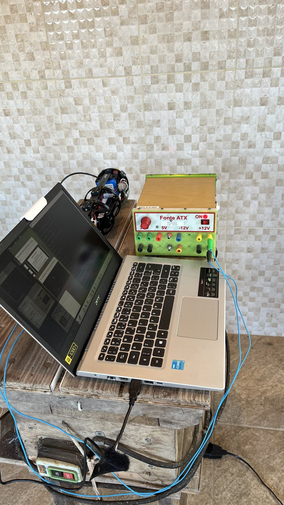 | Lab setup: laptop with PlatformIO, ATX power supply (Fonte ATX), and Station-03 assembly with US-100 sensor pointing at tiled wall |
| 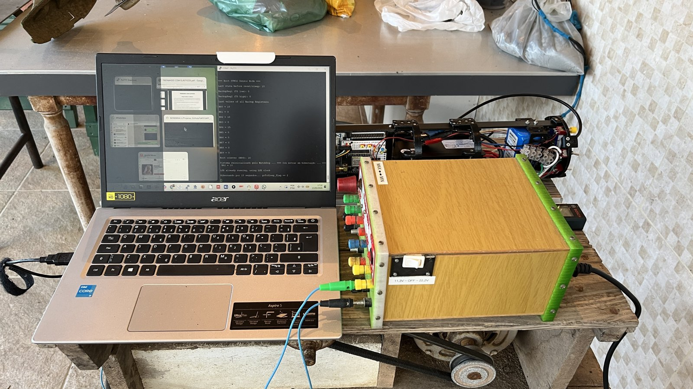 | Workbench overview showing laptop running serial monitor, ATX power supply, and Station-03 hardware assembly |
| 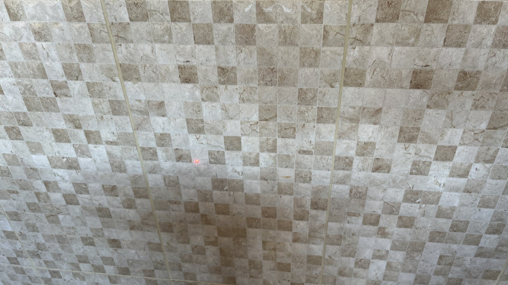 | Target wall (tiled surface) with Bosch GLM 20 laser dot visible at center |
| 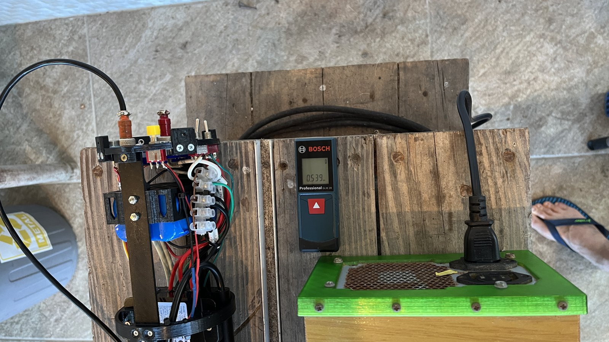 | Close-up of Station-03 sensor assembly, Bosch GLM 20 displaying 0.539m, and ATX power supply |
| 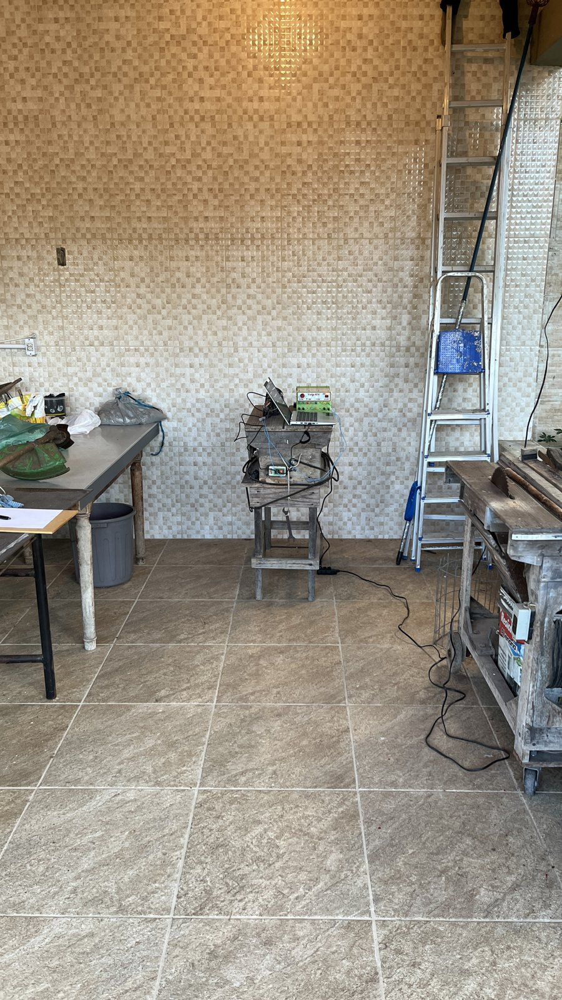 | Indoor test environment showing distance between sensor platform and target wall |
| 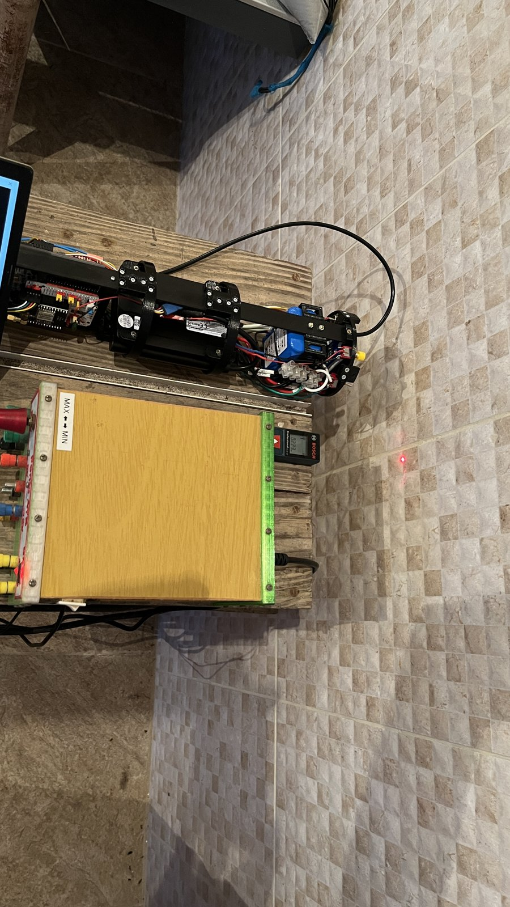 | Station-03 assembly with US-100 sensor pointing horizontally at tiled wall, Bosch laser dot visible on wall |

### 9.2 Outdoor Field Setup

| Photo | Description |
|-------|-------------|
| 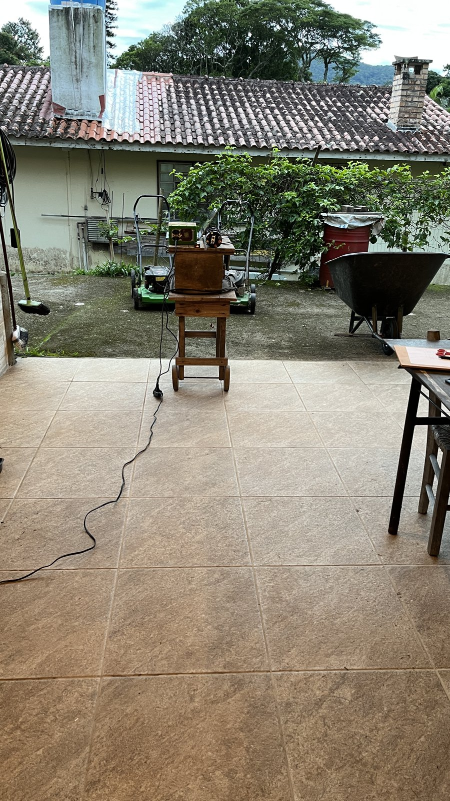 | Outdoor test: sensor on elevated wooden stool at distance from wall target |
| 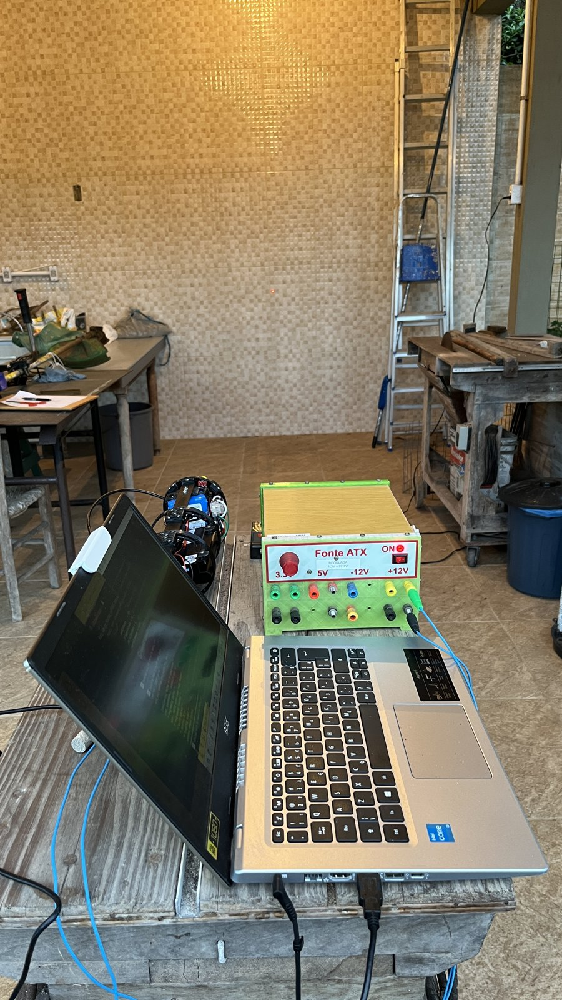 | Outdoor lab setup with laptop, ATX power supply, and sensor assembly on workbench |
| 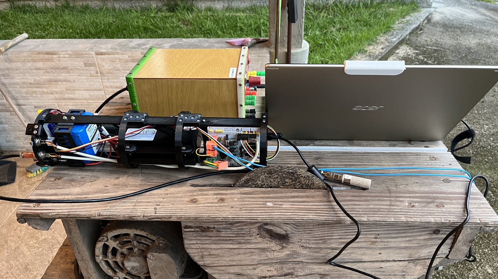 | Side view of Station-03 assembly showing Nucleo L476RG, wiring, battery, and LoRa module |
| 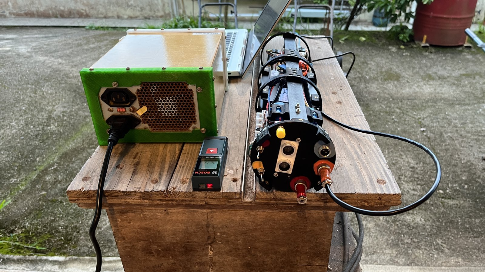 | Rear view of sensor platform with Bosch GLM 20 laser meter and ATX power supply |

### 9.3 Firmware and Hardware Detail

| Photo | Description |
|-------|-------------|
| 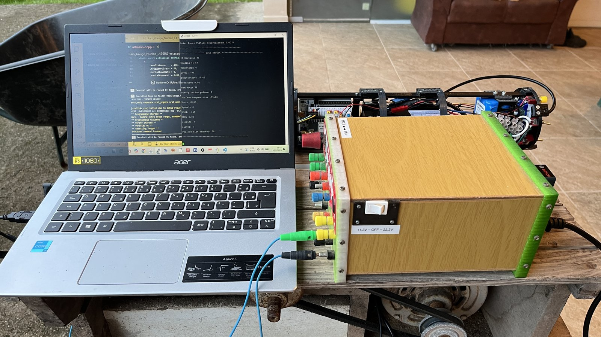 | PlatformIO flashing firmware to Nucleo L476RG, serial monitor showing sensor configuration output |
| 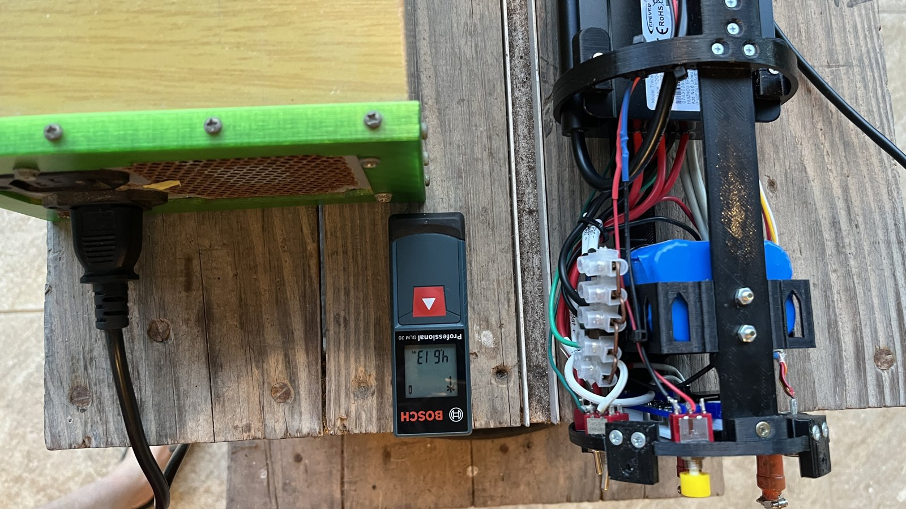 | Close-up of Bosch GLM 20 displaying reference distance alongside Station-03 sensor module with US-100, SHT20, and wiring |
| 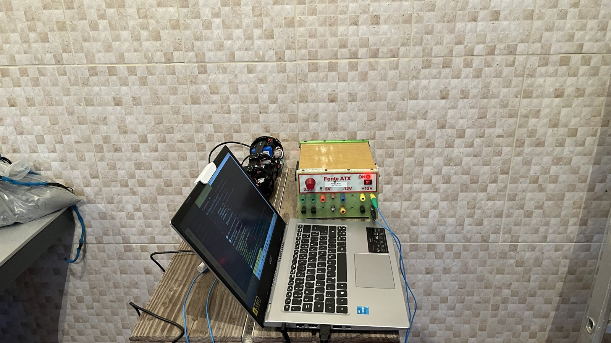 | Front view of test setup: laptop with serial monitor, US-100 sensor, and ATX power supply facing target wall |

---

## 10. Important Observation

**This test was conducted with only one US-100 sensor unit.** The ~180 cm range limitation in trigger/echo mode observed here may be specific to this particular sensor unit (possible manufacturing variation or defect in the echo mode circuitry).

**It is recommended to repeat this test with additional US-100 units** to determine whether:
- The range limitation is a general characteristic of US-100 sensors in echo mode
- This specific unit has a defective echo mode circuit
- There is batch-to-batch variation in echo mode performance

Until validated with additional units, the conclusion that "echo mode has severely limited range" applies only to the tested unit. However, since serial mode is proven to work reliably at ~420 cm with this same unit, **serial mode remains the recommended choice regardless of echo mode validation results**, because serial mode also provides temperature compensation and higher resolution.

---

## 11. Firmware Reference

**File:** `firmware/station-03/src/ultrasonic.cpp`

**Key Configuration:**
```cpp
#define US_SENSOR_TYPE US_SENSOR_HC_SR04  // Echo mode selected (HC-SR04 compatible)
#define NUM_READINGS 11                    // Median of 11 samples
#define MAX_RETRIES 20                     // Retries per reading
#define SOUND_DIVISOR 58                   // Microseconds to cm conversion
```

**Echo Mode Protocol:**
- Trigger pulse: Tested with both 10 us and 50 us HIGH on PC11
- Echo response: Pulse width on PC10
- Distance: `pulse_us / 58` = distance in cm
- Timeout: 38 ms (supports up to ~450 cm theoretically)

**Jumper Configuration (US-100):**
- **Jumper installed** -> Serial/UART mode (9600 baud) **<-- RECOMMENDED**
- **Jumper REMOVED** -> HC-SR04 compatible mode (trigger/echo) **<-- This test (limited to ~180 cm)**

---

## 12. References

1. **US-100_datasheet-01.pdf** (Adafruit) - Serial mode protocol, jumper configuration
2. **US-100.PDF** - Basic specifications, schematic diagram
3. **US_100_ULTRASONIC_SENSOR_MODULE.pdf** - HC-SR04 mode example sketch (10 us trigger)
4. **Bosch GLM 20 Professional** - Reference instrument specifications
5. **US-100_Serial_Mode_Test_Report.md** - Serial mode test results for comparison
6. [Adafruit US-100 Product Page](https://www.adafruit.com/product/4019) - "10cm-250cm will get you the best results"
7. [ProtoSupplies US-100 Module](https://protosupplies.com/product/us-100-ultrasonic-range-finder-module/) - Serial mode recommended over pulse-width
8. [Arduino Forum - US-100 Comparison](https://forum.arduino.cc/t/us-100-ultrasonic-distance-devices-compared-to-hr-sr04-or-similar/398154) - Echo mode accuracy issues
9. SAPI system overview (docs/system-overview.md) - System Architecture Documentation

**Datasheet location:** manufacturer datasheets (not redistributed here)

---

*Report generated as part of SAPI Master's thesis research - IFSC Florianopolis*
