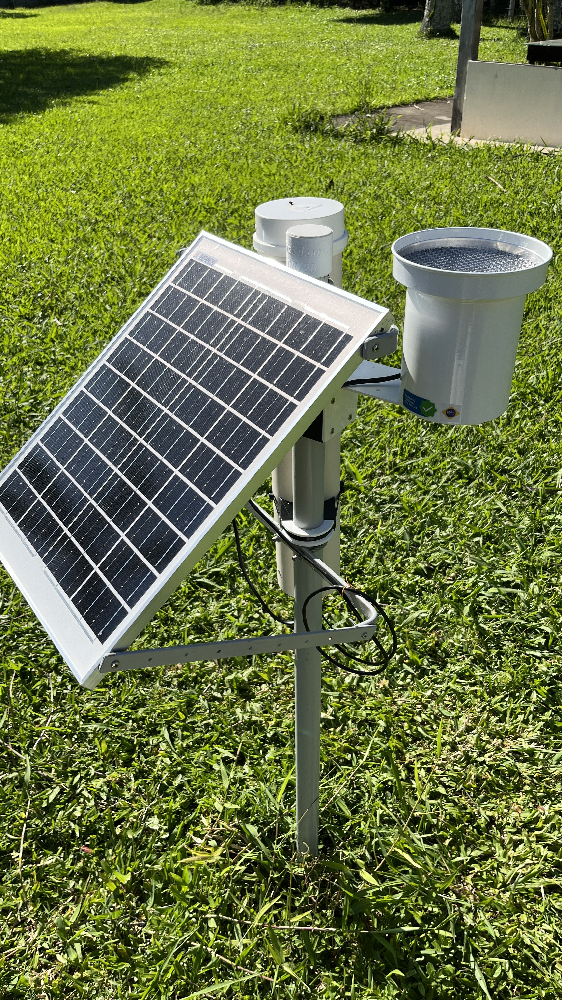
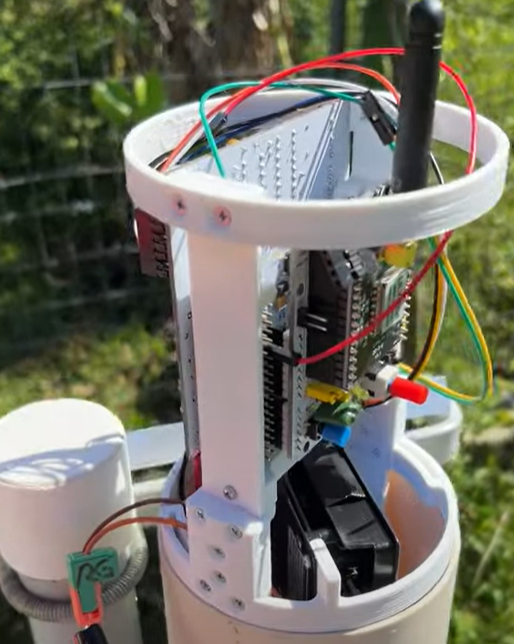
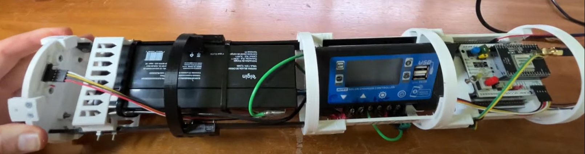

# Rain Gauge Nucleo F103RB (Estação-02)

This is the main production code for the Rain Gauge Station **estacao-02**, developed for a master's degree project.  
The station has been operational since **January 3rd, 2026**.

## 🛠 Hardware Architecture

The station is based on the **STM32 Nucleo F103RB** MCU and utilizes two specialized shields:
* **SAPI LoRa Arduino Shield**: Responsible for long-range wireless communication.
* **SAPI Morpho Shield**: Used for sensor interfacing and power management.

---

## 📊 Live Data & Graphics

You can monitor the real-time sensor data through the following links:

| Variable | Data Visualization Link |
| :--- | :--- |
| 🌡️ **Temperature** | [View Temperature (°C)](https://ilha3d.com/sapi/view.php?id_station=2&var=temperature_C) |
| 🎈 **Pressure** | [View Atmospheric Pressure](https://ilha3d.com/sapi/view.php?id_station=2&var=pressure) |
| 🌧️ **Precipitation** | [View Precipitation Pulses](https://ilha3d.com/sapi/view.php?id_station=2&var=precipitation_pulses) |
| 📡 **Signal (RSSI)** | [View Radio Signal Strength](https://ilha3d.com/sapi/view.php?id_station=2&var=rssi) |
| ☀️ **Panel Voltage** | [View Solar Panel Voltage](https://ilha3d.com/sapi/view.php?id_station=2&var=panel_voltage) |
| 🔋 **Battery** | [View Battery Voltage](https://ilha3d.com/sapi/view.php?id_station=2&var=bat_voltage) |

---

## 📷 Documentation

### General Overview

### MCU and Radio Shield

### Internal Components

---
*Developed as part of a Master's Degree